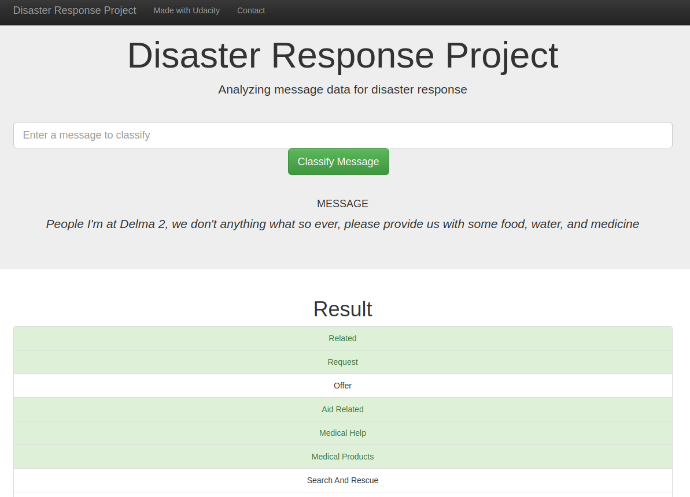

# Disaster Response Pipeline Project

## Introduction

This work is a message classification algorithm using nltk and sklearn to parse and classify messages in a disaster response context.

## Running locally

1. Run the following commands in the project's root directory to set up your database and model.

    - To run ETL pipeline that cleans data and stores in database
        `python data/process_data.py data/disaster_messages.csv data/disaster_categories.csv data/DisasterResponse.db messages`
    - To run ML pipeline that trains classifier and saves
        `python models/train_classifier.py data/DisasterResponse.db messages models/classifier.pkl`

2. Run the following command in the app's directory to run your web app.
    `python app/run.py data/DisasterResponse.db messages models/classifier.pkl`

3. Go to http://0.0.0.0:3001/

## Used libraries

* Pandas
* Numpy
* Nltk
* Sklearn

## Files

* `app/run.py`: Web app to use trained model.
    * Usage: `python app/run.py DATABASE_FILE TABLE_NAME MODEL_PICKLE_FILE`
* `app/template/*.html`: HTML templates used in the web app.
* `data/process_data.py`: Script to load and clean data from csv files and stores it in a SQLite database.
    * Usage: `python data/process_data.py MESSAGES_CSV_FILE CATEGORIES_CSV_FILE DATABASE_FILE TABLE_NAME`
* `data/disaster_messages.csv`: Csv containing messages to train model.
* `data/disaster_categories.csv`: Csv containing categories to train model.
* `models/train_classifier.py`: Script to train and store model.
    * Usage: `python models/train_classifier.py DATABASE_FILE TABLE_NAME MODEL_PICKLE_FILE`

## Acknowledgments

This analysis was made as a part of the Udacity's Data Scientist Nanodegree Program.
